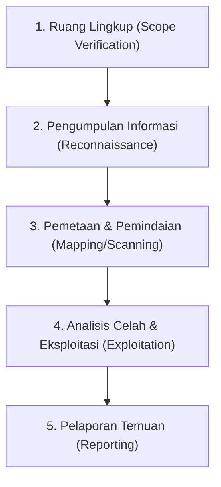

# Hari 9: Bug Bounty & Pentesting Workflow 💼

Hari ini kita akan mempelajari bagaimana cara bekerja secara profesional sebagai peretas etis, baik di industri *Penetration Testing* (jasa audit keamanan) maupun dalam kompetisi *Bug Bounty*.

---

## 🗺️ 1. Alur Kerja Profesional (Professional Workflow)
Seorang peretas profesional tidak langsung menembakkan exploit ke target secara acak. Mereka mengikuti metodologi yang sistematis agar pekerjaannya terukur dan legal:

### Penjelasan Langkah Kerja:
1.  **Scope Verification:** Memastikan domain target terdaftar dalam dokumen legal yang boleh diserang. Menyerang situs di luar scope adalah tindakan **Kriminal**.
2.  **Reconnaissance (Recon):** Mengumpulkan informasi publik mengenai situs target (seperti subdomain, teknologi yang digunakan, IP address).
3.  **Mapping/Scanning:** Menggunakan Burp Site Map dan browser untuk menelusuri seluruh fitur situs guna memahami alur data bisnis aplikasi.
4.  **Exploitation:** Melakukan pengujian celah keamanan menggunakan Burp Proxy, Repeater, atau Intruder berdasarkan temuan pemetaan.
5.  **Reporting:** Mendokumentasikan celah keamanan yang ditemukan secara rinci agar pengembang (developer) situs bisa memperbaikinya.

---

## 📝 2. Cara Menulis Laporan Bug Bounty yang Baik
Sebuah laporan celah keamanan bernilai tinggi jika pihak pengembang dapat mereproduksi (mengulang kembali) langkah eksploitasi Anda dengan mudah. Laporan biasanya ditulis menggunakan format Markdown dan berisi bagian-bagian berikut:

*   **Judul Laporan:** Deskripsi singkat celah (misal: *SQL Injection Login Bypass di Halaman /login.php*).
*   **Tingkat Keparahan (Severity):** Critical (Kritis), High (Tinggi), Medium (Sedang), atau Low (Rendah).
*   **Deskripsi (Description):** Penjelasan mengenai celah keamanan dan dampak buruknya jika dieksploitasi oleh hacker jahat.
*   **Langkah Mereproduksi (Steps to Reproduce):** Panduan langkah-demi-langkah bagi developer untuk menguji celah tersebut.
*   **Bukti Konsep (Proof of Concept / PoC):** Screenshot layar, rekaman video, atau salinan request HTTP mentah dari Burp Suite yang membuktikan bahwa celah tersebut berhasil ditembus.
*   **Rekomendasi Perbaikan (Remediation):** Saran teknis tentang bagaimana developer harus memperbaiki kode programnya agar aman.

---

## 🚀 3. Praktik Alur Kerja Penetrasi & Audit Kerentanan (PortSwigger)
Latihlah alur kerja analisis kerentanan profesional Anda dengan menyelesaikan 2 lab berikut:

### Lab 1: Audit Kontrol Akses Berbasis HTTP Method (Bypass Promosi Jabatan)
*   **Target Lab:** [Method-based access control can be circumvented](https://portswigger.net/web-security/access-control/lab-method-based-access-control-can-be-circumvented)
*   **Fokus Burp Suite:** **Repeater (Method & Cookie Swapping)**
*   **Tujuan:**
    1. Login dengan admin (`administrator:admin`). Lakukan promosi jabatan pada user `carlos` menjadi admin. Tangkap request POST-nya di HTTP History, kirim ke **Repeater**.
    2. Login di browser samaran/lain sebagai user biasa (`wiener:peter`). Salin session cookie wiener.
    3. Di Repeater, ganti session cookie admin dengan cookie milik wiener. Klik Send, Anda akan melihat pesan error Unauthorized.
    4. Ubah request method dari `POST` menjadi `GET` (klik kanan request ➔ **Change request method**). Sesuaikan parameter promosi jabatan menjadi parameter URL GET. Klik Send! Jika berhasil, wiener dapat mempromosikan dirinya sendiri atau menurunkankan jabatan administrator lain karena kelalaian pembatasan method HTTP.
*   **💡 Analogi IT:** Seperti menyelinap ke bioskop VIP dengan kartu tiket kelas biasa, namun Anda berjalan mundur melewati pintu keluar darurat sehingga penjaga menyangka Anda adalah penonton VIP yang baru saja kembali dari toilet.

### Lab 2: Eksploitasi SSRF untuk Menyerang Server Backend Internal
*   **Target Lab:** [Basic SSRF against another back-end system](https://portswigger.net/web-security/ssrf/lab-basic-ssrf-against-backend-system)
*   **Fokus Burp Suite:** **Repeater & Intruder (SSRF Fuzzing)**
*   **Tujuan:** Buka lab di atas. Klik cek stok barang target. Kirim request-nya ke Repeater. Perhatikan parameter URL di body request: `stockApi=http://192.168.0.1:8080/...`. Gunakan **Intruder** untuk memindai oktet terakhir alamat IP lokal (dari `http://192.168.0.1` hingga `http://192.168.0.254`) pada port `8080/admin` guna mencari server backend tersembunyi yang menyimpan portal admin. Setelah IP-nya ketemu di hasil Intruder, gunakan Repeater untuk mengakses IP admin tersebut dan menghapus user `carlos`.
*   **💡 Analogi IT:** Seperti menitipkan surat rahasia kepada satpam gedung untuk ia antarkan langsung ke ruang berkas pribadi direktur utama di lantai atas yang dijaga ketat. Satpam mematuhinya karena menganggap surat itu aman sebab berasal dari dalam gedung.

---

## 📽️ Video Pendukung untuk Hari 9
*   **[Burp Suite Full Course for Beginners | Web Hacking & Bug Bounty 2026](https://www.youtube.com/watch?v=MhxP72H4h3g)** (Bagian akhir video menjelaskan alur kerja bug bounty nyata dan bagaimana menyusun laporan penemuan kerentanan web).
*   **[Day 6 | Burp Suite Full Course with AI (Beginner to Pro) 2026](https://www.youtube.com/watch?v=FzFdBHAtTl4)** (Tips praktis memulai perjalanan karir sebagai Bug Bounty Hunter menggunakan Burp Suite).
